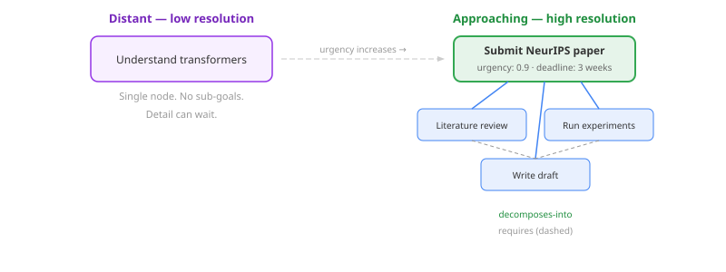
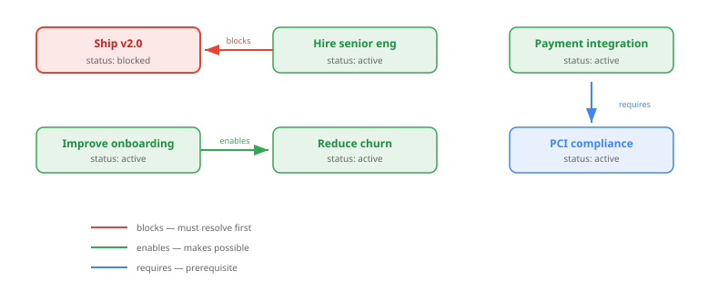
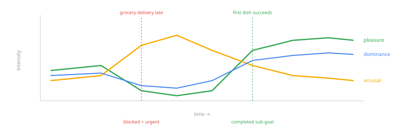
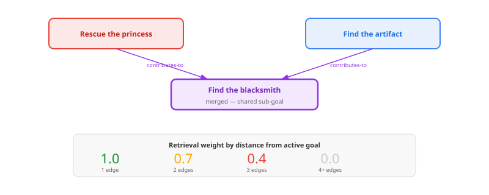
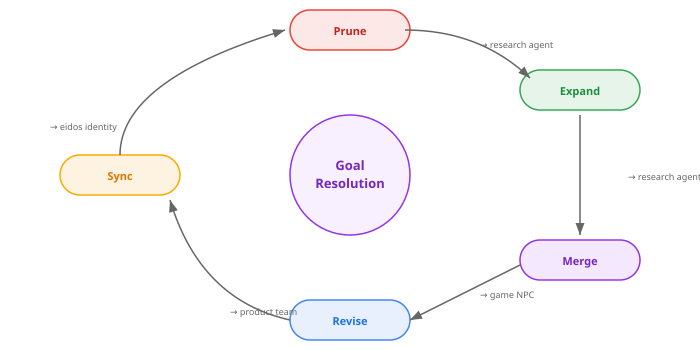
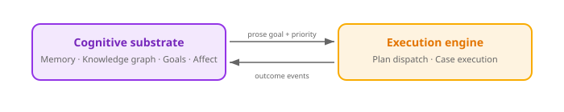

# When your agent forgets what it wants

Most agent frameworks treat goals the same way they treat prompts — as strings that exist for one request and vanish. The LLM receives "help the user book a flight," generates some actions, and when the actions stop, the goal is gone. No memory of it. No record of what blocked it. No sense of whether pursuing it felt productive or frustrating. No way to notice that two different goals both need the same sub-task.


This is like building a person who can only think about one thing at a time and forgets it the moment they look away.

What if goals were persistent? What if they had structure — dependencies, sub-goals, temporal horizons? What if pursuing a goal *felt like something* to the agent — urgency as a deadline approaches, frustration when something blocks progress, satisfaction when it's done? What if the agent's memory retrieval was biased by what it's currently trying to achieve?

Here's what happens when you build that. Four scenarios, four capabilities.

## The research agent: goals at different resolutions

A PhD student's research agent tracks two goals. "Understand transformers" is aspirational — years away, no deadline, no decomposition needed. "Submit NeurIPS paper" is due in three weeks.



This is **progressive resolution** — borrowed from level-of-detail rendering in computer graphics (Clark, 1976). Nearby objects get high-fidelity polygons; distant objects get low-poly placeholders. The same principle applies to goal knowledge.

A background consolidation phase manages both directions. As the paper deadline approaches and urgency rises, the system invokes a cognitive decomposition SPI to break the goal into sub-tasks — literature review, experiments, writing — linked by `decomposes-into` edges. When a distant goal's sub-tasks haven't been accessed, the system prunes them back to a single node. Detail is re-derived when needed, not maintained permanently.

```java
public interface Goallike {
    Optional<String> description();
    Optional<String> status();
    Optional<String> horizon();    // immediate / short / medium / long / aspirational
    Optional<String> origin();     // drive / conversation / reflection / experience
    Optional<String> resolution(); // low / medium / high
    Optional<String> urgency();    // 0.0–1.0
    Optional<String> feasibility();
}
```

Seven properties. That's what separates a structured goal from a string.

## The product manager: dependencies change everything

A product team agent tracks feature goals with dependency edges. "Ship v2.0" is blocked by "hire senior engineer." "Improve onboarding" enables "reduce churn." "Build payment integration" requires "PCI compliance review."



The five edge types (`enables`, `blocks`, `requires`, `contributes-to`, `decomposes-into`) encode different dependency semantics. `blocks` and `requires` form a DAG constraint — circular dependencies are rejected on creation. `enables` and `contributes-to` allow cycles because mutual enablement is semantically valid.

When the hiring goal completes, the Revise step of the consolidation cycle detects the resolved blocker. "Ship v2.0" transitions from `blocked` to `active`. Priority recomputes — it's now the highest-urgency actionable goal. The agent's attention shifts without anyone explicitly telling it to.

## The personal assistant: goals have feelings

A personal assistant agent notices something: the user keeps asking about cooking. Recipes, meal prep, kitchen equipment. Nobody said "I want to learn to cook" — but the pattern is there.

The GoalRecognitionPhase scans recent experience memories for goal-like content. When the recognizer detects an implicit goal above its confidence threshold, it creates a goal node in the knowledge graph — origin tagged as `experience`, horizon as `medium-term`.

Once tracked, the goal accumulates affect.



Each goal node carries PAD emotional dimensions — pleasure, arousal, dominance. The GoalAffectPhase computes anticipated affect from the goal's current state:

- **High urgency, approaching deadline** → increased arousal. The agent's attention heightens.
- **Blocked and important** → frustration. Negative pleasure, high arousal. The agent feels stuck.
- **Recently completed** → satisfaction. Positive pleasure shift. The agent feels progress.
- **Dormant, declining interest** → reduced arousal. The goal fades from active attention.

This isn't anthropomorphic decoration. Appraisal theory (Scherer, 2001) models emotions as evaluations relative to goals. How you feel about a situation depends on its relationship to what you're trying to achieve. The affect values feed into retrieval modulation, priority computation, and the curiosity system — they're functional signals, not narrative flourish.

## The game NPC: shared sub-goals and biased memory

A game character pursues two quests simultaneously: "Rescue the princess" and "Find the ancient artifact." Both require finding the blacksmith — one for weapons, one for a map.



The Merge step detects semantically similar sub-goals across different parents. "Find the blacksmith shop" and "find the blacksmith store" — Jaro-Winkler similarity above 0.85 — get merged into a single node with `contributes-to` edges to both parents. The task is done once, benefiting both quests.

Meanwhile, the `GoalRelevanceModulationFactor` biases memory retrieval by graph proximity to active goals. When the NPC is actively pursuing the rescue quest, memories one edge away from that goal (the blacksmith's location, weapon types, castle layout) surface at full weight. Memories two edges away get 0.7. Three edges: 0.4. Four or more: invisible. The agent's recall is shaped by what it's currently trying to do — exactly how human memory works under goal-directed attention (Anderson, 2007).

## The consolidation sleep cycle

These four capabilities — expand, prune, merge, revise — don't run in real time. They run during "sleep."



The existing consolidation scheduler — a background timer that runs maintenance phases when the system is idle — gains four new phases at priorities 35-45. Each phase operates on the GOAL subgraph regardless of whether curiosity signals prioritise it. Goal processing is not optional.

The step ordering is load-bearing. Expand runs before Merge because newly created sub-goals are candidates for cross-parent merging. Revise runs before Sync because internal dependency updates should settle before importing external lifecycle state. Sync runs last because it imports authoritative state from the identity layer — subsequent phases use those updated values.

This mirrors what human sleep consolidation actually does — prune irrelevant detail, strengthen relevant connections, surface relationships that weren't obvious during waking cognition (Walker, 2017).

## The priority formula

With affect computed and dependencies mapped, the system ranks competing goals:

```
priority = 0.3 × urgency + 0.2 × feasibility + 0.2 × affective_valence + 0.3 × importance
```

Where `affective_valence = (pleasure + dominance + 2) / 4` maps PAD dimensions to a 0–1 score (neutral PAD yields 0.5), and `importance` counts inbound `contributes-to` and `enables` edges normalised by the maximum across active goals. Goals that many other goals depend on are structurally important, independent of how urgent or pleasant they are.

The priority score is a substrate signal. The agent's orchestration layer decides what to do with it — goal selection, prompt ordering, capacity allocation. The cognitive layer computes; the behavioral layer acts.

## The narrow interface

One concern going in: would a cognitive goal layer create tight coupling between the memory system, the behavioral orchestration, and the execution engine?



Two channels. Goals flow out as prose descriptions with priority scores. Outcomes flow back as experience events. No shared graph types. No shared goal records. The cognitive goal graph lives in the knowledge store. The execution engine's plans live in their own data structures. Each system evolves independently.

The SPIs for cognitive operations that need LLMs — goal decomposition, goal recognition, lifecycle state queries — are defined by the cognitive layer with no-op defaults. A standalone deployment (no LLM, no orchestration) gets goal storage, recognition, and affect without progressive resolution. The cognitive graph is still valuable without decomposition — manually created goals, recognised goals, and their dependency edges all function. Progressive resolution is an enhancement, not a prerequisite.

## What this opens up

Three capabilities sit just beyond the current implementation, each building on the substrate that's now in place.

**Opportunity cost.** With structured goals and computed priorities, the agent can reason about trade-offs: pursuing A means not pursuing B. The priority scores and feasibility estimates provide the raw material; the orchestration layer surfaces the trade-off.

**Avoidance patterns.** A goal with high importance but high difficulty develops a characteristic affect signature — elevated arousal with declining pleasure. The agent starts avoiding related topics, which suppresses retrieval of relevant memories, which further delays progress. Modelling this feedback loop is the difference between an agent that procrastinates and one that doesn't.

**Emergent goals.** When the Revise step resolves a dependency, new possibilities emerge. Achieving A reveals that B is now possible. The recognition phase could scan the updated dependency graph for newly unblocked opportunities — goals the agent didn't know it could pursue until something else was accomplished.

Goals are not strings. They're knowledge.

---

**References**

- Anderson, J.R. (2007). *How Can the Human Mind Occur in the Physical Universe?* Oxford University Press. — ACT-R: goal-directed retrieval bias
- Clark, J.H. (1976). "Hierarchical Geometric Models for Visible Surface Algorithms." *Communications of the ACM*. — Level-of-detail rendering
- Scherer, K.R. (2001). "Appraisal Considered as a Process of Multilevel Sequential Checking." *Appraisal Processes in Emotion*. — Goals as emotional reference points
- Walker, M.P. (2017). *Why We Sleep.* Scribner. — Sleep consolidation: pruning, strengthening, discovery
